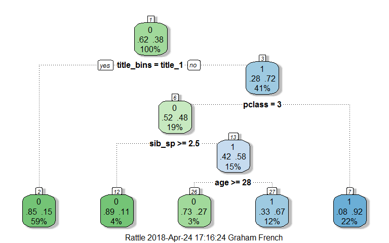

```r
# Tidyverse
library(dplyr)
library(purrr)
library(tidyr)
library(readr)
library(stringr)
library(forcats)
library(janitor)
library(here)
library(magrittr)

# data
library(titanic)

# models
library(rpart)
library(rattle)
library(randomForest)
library(party)
```

## Tutorials

The following tutorial helped with learning and applying machine learning to analyse Kaggle's [Titanic Machine Learning from Disaster](https://www.kaggle.com/c/titanic) Prediction Competition

* [Vincent Broute's Titanic EDA & predictions attempt](https://www.kaggle.com/neveldo/titanic-eda-predictions-attempt)
* [Megan Risdal Exploring Survival on the Titanic](https://www.kaggle.com/mrisdal/exploring-survival-on-the-titanic)
* [Trevor Stephens Titanic: Getting Started with R Titanic Tutorial](http://trevorstephens.com/kaggle-titanic-tutorial/getting-started-with-r/)

## Functions

### Export titanic dataset

```r
titanic_export <- function(dataset, title) {
  dataset %>%
    write_csv(here(str_glue("titanic_dataset_{title}.csv")))
  return(dataset)
}
```

### Export kaggle submission

```r
kaggle_submission <- function(test, model) {
  test %>%
    mutate(PassengerId = passenger_id,
           Survived = survived) %>% 
    select(PassengerId, Survived) %T>% 
    write_csv(here(str_glue("kaggle_submission_{model}.csv")))
  return(test)
}
```

## Titanic dataset

The titanic package contains both the training and test data. Columns names converted to lower case


```r
train <- titanic_train %>% 
  clean_names()
test <- titanic_test %>% 
  clean_names()
```

## Feature engineering

Training and test datasets combined to clean data and extract additional useful variables


```r
titanic <- bind_rows(train, test) %>% 
  titanic_export("original")
```

### survived

Feature to predict in test dataset. Converted to factor


```r
titanic <- titanic %>% 
  mutate(survived = as_factor(as.character(survived)))

titanic %>% 
  tabyl(survived) %>% 
  adorn_pct_formatting(digits = 1)
```

```
 survived   n percent valid_percent
        0 549   41.9%         61.6%
        1 342   26.1%         38.4%
     <NA> 418   31.9%             -
```

### pclass

Three passenger class, feature kept as is, just converted to a factor


```r
titanic <- titanic %>% 
  mutate(pclass = as_factor(as.character(pclass)))

titanic %>% 
  tabyl(pclass) %>% 
  adorn_pct_formatting(digits = 1)
```

```
 pclass   n percent
      3 709   54.2%
      1 323   24.7%
      2 277   21.2%
```

### name

Useful features extracted from the names were the titles and surnames used to determine family groups

**Title**

An additional variable extracted was the title from the names. This was taken from [Vincent Broute's post](https://www.kaggle.com/neveldo/titanic-eda-predictions-attempt/notebook)


```r
titanic <- titanic %>%
  mutate(title = str_extract(name, regex("([a-z]+\\.)", ignore_case = TRUE)),
         title = str_replace(title, "\\.", ""),
         title = as_factor(title))

# Group titles into refined groups
titanic <- titanic %>%
  mutate(title_bins = case_when
         (
           title %in% c("Capt", "Don", "Jonkheer", "Rev", "Mr") ~ "title_1",
           title %in% c("Col", "Dr", "Major", "Master") ~ "title_2",
           TRUE ~ "title_3"
          )
      ) %>% 
  mutate(title_bins = as_factor(title_bins))
         
titanic %>% 
  tabyl(title, title_bins) 
```

```
    title title_1 title_3 title_2
       Mr     757       0       0
      Mrs       0     197       0
     Miss       0     260       0
   Master       0       0      61
      Don       1       0       0
      Rev       8       0       0
       Dr       0       0       8
      Mme       0       1       0
       Ms       0       2       0
    Major       0       0       2
     Lady       0       1       0
      Sir       0       1       0
     Mlle       0       2       0
      Col       0       0       4
     Capt       1       0       0
 Countess       0       1       0
 Jonkheer       1       0       0
     Dona       0       1       0
```

**surname**


```r
titanic <- titanic %>%
  mutate(surname = str_extract(name, regex("([a-z]+,)", ignore_case = TRUE)),
         surname = str_replace(surname, ",", ""))
```

### sex

Useful feature, keep as is, just convert to a factor


```r
titanic <- titanic %>% 
  mutate(sex = as_factor(sex))

titanic %>%
  tabyl(sex) %>% 
  adorn_pct_formatting(digits = 1)
```

```
    sex   n percent
   male 843   64.4%
 female 466   35.6%
```

### age

Age is not know for 263 passengers. Missing ages predicted using a decision tree


```r
# Training dataset
train_age <- titanic %>% 
  filter(!is.na(age))

# Run decision tree on training dataset with known ages
fit_age <- rpart(age ~ pclass + sex + sib_sp + parch + fare + embarked,
                 data = train_age,
                 method = "anova")

# Update missing ages with predicted ages
test_age <- titanic %>% 
  filter(is.na(age)) %>% 
  mutate(age = predict(fit_age, .))

# Recombine training and test datasets
titanic <- bind_rows(train_age, test_age)
```

[Vincent Broute]((https://www.kaggle.com/neveldo/titanic-eda-predictions-attempt/notebook)) found that passengers 12 years old or less had a greater chance of survival and passengers 18-25 years old has a less chance so group age into these 3 groups


```r
titanic <- titanic %>% 
  mutate(age_bins = cut(age, breaks = c(0, 12, 18, 25, 80), 
                         include.lowest = TRUE,
                         labels = c("age_0-12", "age_12-18", "age_18-25", "age_25-80"),
                         ordered_factor = TRUE)) %>% 
  mutate(age_bins = fct_other(age_bins, keep = c("age_0-12", "age_18-25")))

titanic %>% 
  tabyl(age_bins) %>% 
  adorn_pct_formatting(digits = 1)
```

```
  age_bins   n percent
  age_0-12 106    8.1%
 age_18-25 263   20.1%
     Other 940   71.8%
```

### sib_sp and parch

sib_sp (number of sibling or spouses aboard) and parch (number of parents or children aboard) can by combined to create a new **family_size** feature where family size is the number of family members a passenger is travelling with, adding up the siblings, spouses, parents and children, and adding one for the passenger themselves


```r
titanic <- titanic %>%
  mutate(family_size = sib_sp + parch + 1)
```

Analysis done by [Megan Risdal](https://www.kaggle.com/mrisdal/exploring-survival-on-the-titanic) shows that singletons or larger families above 4 members did not survive as much as passengers within a family of less than 4 members so group family size into these 3 groups


```r
titanic <- titanic %>%
    mutate(family_size_bins = cut(family_size, breaks = c(0, 1, 4, 11), 
                         include.lowest = TRUE,
                         labels = c("singleton", "family_size_1-4", "family_size_1-11"),
                         ordered_factor = TRUE))

titanic %>% 
  tabyl(family_size_bins) %>% 
  adorn_pct_formatting(digits = 1)
```

```
 family_size_bins   n percent
        singleton 790   60.4%
  family_size_1-4 437   33.4%
 family_size_1-11  82    6.3%
```

[Trevor Stephens](http://trevorstephens.com/kaggle-titanic-tutorial/r-part-4-feature-engineering/) suggested larger famlies would have had difficulty keeping together. To dentify each family, family size was combined with surname to create new **family_id** feature. This assumed that families with the same surname did not have the same family size


```r
titanic <- titanic %>%
  unite(family_id, surname, family_size, remove = FALSE)
```

Trevor combined passengers within small family units of 1-2 individuals


```r
titanic <- titanic %>%
  mutate(family_id = if_else(family_size <= 2, "small_family_unit", family_id))
```

[Megan Risdal](https://www.kaggle.com/mrisdal/exploring-survival-on-the-titanic) determined whether the passenger was a mother with a child on board or not


```r
titanic <- titanic %>%
  mutate(mother = if_else(sex == "female" & parch != 0 & age > 18 & title != "Miss", "mother", "not_mother"),
         mother = as_factor(mother))

titanic %>% 
  tabyl(mother) %>% 
  adorn_pct_formatting(digits = 1)
```

```
     mother    n percent
 not_mother 1224   93.5%
     mother   85    6.5%
```

### ticket

Feature not currently used in model

### fare

One third class passenger fare is unknown, replaced with the median price of third class fare ticket


```r
titanic %>% 
  group_by(pclass) %>% 
  summarise(avg_fare = median(fare, na.rm = TRUE))
```

```
# A tibble: 3 x 2
  pclass avg_fare
  <fct>     <dbl>
1 3          8.05
2 1         60.0 
3 2         15.0 
```

```r
titanic <- titanic %>%
  mutate(fare = replace_na(fare, 8.05))
```

### cabin

High number of missing values, feature not used in model

### embarked

Two passengers have an unknown embarked port. Analysis done by [Megan Risdal](https://www.kaggle.com/mrisdal/exploring-survival-on-the-titanic) shows that the median fare for the class both passengers coincides with them embarking at Charbourg. Feature converted to factor


```r
titanic <- titanic %>%
  mutate(embarked = if_else(embarked == "", "C", embarked))

titanic <- titanic %>% 
  mutate(embarked = as_factor(embarked))

titanic %>% 
  tabyl(embarked) %>% 
  adorn_pct_formatting(digits = 1)
```

```
 embarked   n percent
        S 914   69.8%
        C 272   20.8%
        Q 123    9.4%
```

**Export titanic dataset**


```r
titanic <- titanic %>% 
  select(passenger_id, 
         name, surname, title, title_bins,
         sex,
         age, age_bins,
         family_id, family_size, family_size_bins, sib_sp, parch, mother,
         ticket, fare, cabin, pclass, embarked,
         survived) %>% 
  arrange(surname, family_id, -age) %T>% 
  titanic_export("feature_engineered")
```

## Training dataset


```r
# Training dataset
train_survived <- titanic %>% 
  filter(!is.na(survived))
```

## Logistic regression

Logistic regression to find the statsitically significant predictor features used by [Vincent Boute](https://www.kaggle.com/neveldo/titanic-eda-predictions-attempt/notebook)


```r
fit_survived <- glm(survived ~ title_bins + sex + age + family_size_bins + sib_sp + parch + mother + fare + pclass + embarked,
                    data = train_survived,
                    family = binomial)
summary(fit_survived)
```

```

Call:
glm(formula = survived ~ title_bins + sex + age + family_size_bins + 
    sib_sp + parch + mother + fare + pclass + embarked, family = binomial, 
    data = train_survived)

Deviance Residuals: 
    Min       1Q   Median       3Q      Max  
-2.7381  -0.5463  -0.4070   0.5827   2.4475  

Coefficients:
                                  Estimate Std. Error z value Pr(>|z|)    
(Intercept)                      -1.676680   0.317304  -5.284 1.26e-07 ***
title_binstitle_3                 2.684296   2.088064   1.286 0.198603    
title_binstitle_2                 2.511816   0.446848   5.621 1.90e-08 ***
sexfemale                         0.338156   2.077910   0.163 0.870724    
age                              -0.028784   0.009254  -3.110 0.001868 ** 
family_size_binsfamily_size_1-4  -0.112281   0.349468  -0.321 0.747990    
family_size_binsfamily_size_1-11 -2.588078   1.052698  -2.459 0.013951 *  
sib_sp                           -0.101382   0.203631  -0.498 0.618574    
parch                             0.064626   0.232406   0.278 0.780956    
mothermother                      0.297613   0.508281   0.586 0.558193    
fare                              0.003501   0.002583   1.356 0.175193    
pclass1                           1.990273   0.330865   6.015 1.79e-09 ***
pclass2                           0.968733   0.256508   3.777 0.000159 ***
embarkedC                         0.270803   0.255339   1.061 0.288890    
embarkedQ                         0.240413   0.346810   0.693 0.488175    
---
Signif. codes:  0 '***' 0.001 '**' 0.01 '*' 0.05 '.' 0.1 ' ' 1

(Dispersion parameter for binomial family taken to be 1)

    Null deviance: 1186.66  on 890  degrees of freedom
Residual deviance:  726.67  on 876  degrees of freedom
AIC: 756.67

Number of Fisher Scoring iterations: 5
```

The prediction features statistically significant according to p-values were title_bins, age and pclass. Vincent also found the sib_sp was a significantly significant predictor feature


```r
fit_survived <- glm(survived ~ title_bins + age + pclass + sib_sp,
                    data = train_survived,
                    family = binomial)
summary(fit_survived)
```

```

Call:
glm(formula = survived ~ title_bins + age + pclass + sib_sp, 
    family = binomial, data = train_survived)

Deviance Residuals: 
    Min       1Q   Median       3Q      Max  
-2.5888  -0.5726  -0.3867   0.5809   2.6574  

Coefficients:
                  Estimate Std. Error z value Pr(>|z|)    
(Intercept)       -1.53321    0.28640  -5.353 8.63e-08 ***
title_binstitle_3  3.09715    0.20915  14.809  < 2e-16 ***
title_binstitle_2  2.48015    0.41892   5.920 3.21e-09 ***
age               -0.03098    0.00852  -3.636 0.000277 ***
pclass1            2.37241    0.26506   8.950  < 2e-16 ***
pclass2            1.11096    0.24015   4.626 3.73e-06 ***
sib_sp            -0.55913    0.11189  -4.997 5.82e-07 ***
---
Signif. codes:  0 '***' 0.001 '**' 0.01 '*' 0.05 '.' 0.1 ' ' 1

(Dispersion parameter for binomial family taken to be 1)

    Null deviance: 1186.66  on 890  degrees of freedom
Residual deviance:  749.27  on 884  degrees of freedom
AIC: 763.27

Number of Fisher Scoring iterations: 5
```

## Models

### Decision Trees

[Trevor Stephen's Part 3 tutorial](http://trevorstephens.com/kaggle-titanic-tutorial/r-part-3-decision-trees/) tutorial calculated survival using decision trees, using the default control values and titanic features


```r
model_name <- "decision_tree"

# Run decision tree on training dataset with known survival
fit_survived <- rpart::rpart(survived ~ title_bins + age + pclass + sib_sp,
                      data = train_survived,
                      method = "class",
                      control = rpart::rpart.control(minsplit = 20, cp = 0.01)) %T>% 
  rattle::fancyRpartPlot()
```

<!-- -->

```r
# Update missing survival with predicted survival
test_survived <- titanic %>% 
  filter(is.na(survived)) %>% 
  mutate(survived = predict(fit_survived, ., type = "class")) %T>% 
  kaggle_submission(model_name)

# Recombine training and test datasets
titanic_dt <- bind_rows(train_survived, test_survived) %T>% 
  titanic_export(model_name)

# Summarise survival
test_survived %>% 
  tabyl(survived) %>% 
  adorn_pct_formatting(digits = 1) 
```

```
 survived   n percent
        0 266   63.6%
        1 152   36.4%
```

### Random Forest

[Trevor Stephen's Part 5 tutorial](http://trevorstephens.com/kaggle-titanic-tutorial/r-part-5-random-forests/)  calculated survival using random forest method

Random Forest method does not allow for missing values and requires factors for Survived and discrete variables


```r
model_name <- "random_forest"
  
# Run random forest on training dataset with known survival
set.seed(415)
fit_survived <- randomForest::randomForest(survived ~ title_bins + age + pclass + sib_sp,
                data = train_survived,
                importance = TRUE,
                ntree = 2000) %T>% 
  randomForest::varImpPlot()
```

<!-- -->

```r
# Update missing survival with predicted survival
test_survived <- titanic %>% 
  filter(is.na(survived)) %>% 
  mutate(survived = predict(fit_survived, .)) %T>% 
  kaggle_submission(model_name)

# Recombine training and test datasets
titanic_rf <- bind_rows(train_survived, test_survived) %T>% 
  titanic_export(model_name)

# Summarise survival
test_survived %>% 
  tabyl(survived) %>% 
  adorn_pct_formatting(digits = 1) 
```

```
 survived   n percent
        0 267   63.9%
        1 151   36.1%
```

### Conditional inference trees

[Trevor Stephen's Part 5 tutorial](http://trevorstephens.com/kaggle-titanic-tutorial/r-part-5-random-forests/) calculated survival using conditional inference tree method


```r
model_name <- "conditional_inference"

set.seed(415)

# Run Conditional inference trees on training dataset with known survival
fit_survived <- party::cforest(survived ~ title_bins + age + pclass + sib_sp,
                      data = train_survived,
                      controls = party::cforest_unbiased(ntree = 2000, mtry = 3))
                      
# Update missing survival with predicted survival
test_survived <- titanic %>% 
  filter(is.na(survived)) %>% 
  mutate(survived = predict(fit_survived, ., OOB = TRUE, type = "response")) %T>% 
  kaggle_submission(model_name)

# Recombine training and test datasets
titanic_ci <- bind_rows(train_survived, test_survived) %T>% 
  titanic_export(model_name)

# Summarise survival
test_survived %>% 
  tabyl(survived) %>% 
  adorn_pct_formatting(digits = 1) 
```

```
 survived   n percent
        0 268   64.1%
        1 150   35.9%
```

## Kaggle submission

| model | survived | died | kaggle_score |
|:----- |:-------- |:---- |:------------ |
| decision tree | 152 | 266 | 0.77511 |
| random forest | 151 | 267 | 0.76555 |
| conditional inference | 150 | 268 | 0.78468 |
  

